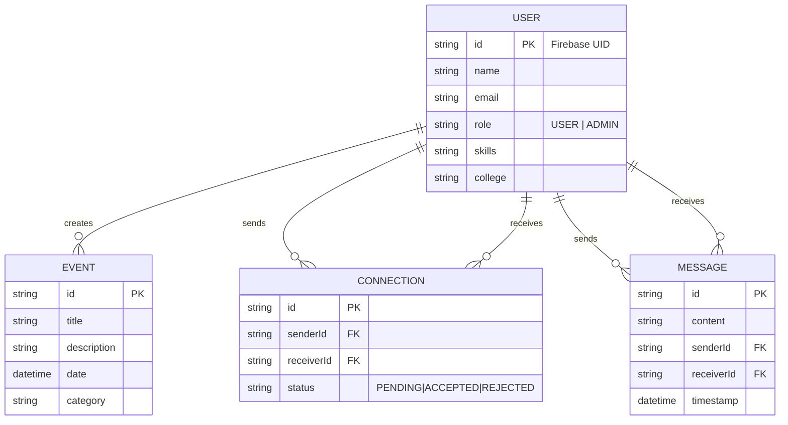

# ASG Platform: Investor & Stakeholder Presentation Content

This document contains a slide-by-slide breakdown for the Apex Startup Group (ASG) platform pitch. It includes technical architecture, business logic, and UI mockups.

---

## Slide 1: Mission & Vision
**Title**: Apex Startup Group (ASG)  
**Subtitle**: Empowering the Next Generation of Founders  
**Visual**:   
**Content**:
- Unified ecosystem for Students, Founders, and Mentors.
- Bridging the gap between institutional learning and startup success.
- Powered by Data, AI, and Community.

---

## Slide 2: The Problem we Solve
**Challenge**: Fragmentation in the startup support system.  
**Solution**: A single interface to manage innovation tracks, institutional records (NAAC), and professional networking.
- **Accessibility**: Mobile-first approach for 24/7 connectivity.
- **Data-Driven**: Structured repos for talent discovery.

---

## Slide 3: Core Technology Stack
**Architecture**: Cloud-Native Full-Stack Android Platform  
**Details**:
- **Mobile Foundation**: Native Android (Kotlin & Jetpack Compose).
- **Backend Architecture**: Node.js with Express and Prisma ORM.
- **Data Persistence**: Highly scalable PostgreSQL.
- **Infrastructure**: Render for hosting, Firebase for Auth and Push Notifications.

---

## Slide 4: User Onboarding (UX Highlight)
**Visual**:   
**Key Features**:
- Mandatory 4-step registration: Identity, Role, Institution, Interests.
- Ensures a high-trust community by mapping users to specific cohorts (Student/Founder/Investor).

---

## Slide 5: Innovation Dashboard
**Visual**:   
**Key Features**:
- **NAAC/NEP Integration**: Direct logging of institutional innovation milestones.
- **Ecosystem Map**: Interactive visualization of local startup density.
- **Hackathon Portal**: End-to-end event management from registration to demo.

---

## Slide 6: Student Repository & Networking
**Visual**:   
**Key Features**:
- Talent search by skills, college, or role.
- One-click 'Connect' logic for mentoring or co-founding requests.

---

## Slide 7: Database Architecture (Technical Schema)
**Model ERD**:

---

## Slide 8: Development Budget (MVP Phase)

> [!NOTE]
> Estimated figures for a 12-week development cycle for 2026.

| Item | Estimated Cost | Details |
| :--- | :--- | :--- |
| **UI/UX Design** | $9,000 | Branding, Component Library, Figma Prototypes |
| **Android Dev** | $18,000 | Kotlin/Compose App Development |
| **Backend & Cloud** | $12,000 | Node.js API, PostgreSQL DB, CI/CD Setup |
| **QA & Security** | $4,500 | functional testing & pen-testing |
| **Cloud Ops (Y1)** | $1,500 | Render, Firebase, and Managed DB costs |
| **TOTAL** | **$45,000** | Initial Launch Phase |

---

## Slide 9: Future Roadmap
- **ASG AI Agent**: Voice-activated startup advisor.
- **Global Networking**: Cross-institutional hub for collaborative hacking.
- **Investment Portal**: Direct pipeline from MVP repo to Seed funding.

---

### Speaker Notes
1. **Slide 1**: Emphasize that ASG is not just an app, it's a movement to systematize entrepreneurship in colleges.
2. **Slide 8**: The budget focuses purely on technical delivery. Marketing and Ops are excluded from the Dev budget.
